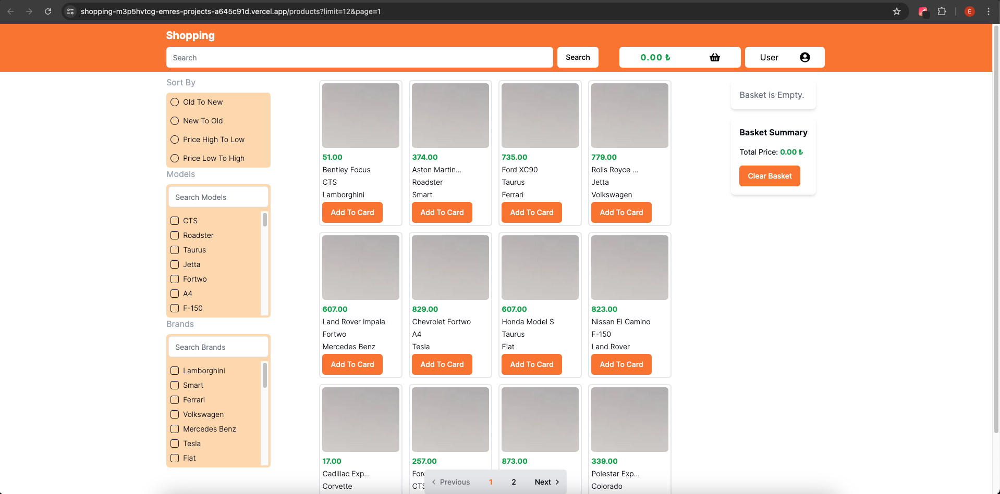

# Shopping Web Project

This project is a shopping web application built using Next.js, Zustand for state management, and Shacdn UI library for UI components.

## Live Demo

Check out the live demo: [Shopping Web](https://ts-e-commerce-rho.vercel.app/products?limit=12&page=1)

## Technologies Used

- **Next.js**: A React framework for server-rendered applications.
- **Zustand**: A small, fast and scalable state management library for React.
- **Shacdn UI**: A UI component library used for building the user interface.
- **pnpm**: A fast, disk-space efficient package manager.

## Getting Started

To get a local copy up and running, follow these steps:

1. **Clone the repository**:

   ```bash
   git clone <repository-url>
   cd project-directory

   ```

2. Install dependencies:

Make sure you have Node.js and pnpm installed. Then run:

pnpm install

3. Run the development server:

pnpm dev

Open http://localhost:3000 in your browser to see the app.

## Features

- **Responsive Design**: The application is fully responsive to ensure compatibility across various devices.
- **Pagination**: Products are paginated to enhance user experience.
- **State Management**: Zustand is used for efficient and scalable state management.
- **Custom Hooks**: Custom hooks are utilized for managing filters and pagination.
- **Loading States**: Skeleton loading screens are implemented to improve perceived performance.

## Deployment

The project is deployed using Vercel. For deployment details, refer to the [Next.js deployment documentation](https://nextjs.org/docs/deployment).

## Contributing

Contributions are welcome! Please feel free to fork the repository and submit pull requests.

## License

This project is licensed under the [MIT License](LICENSE).


